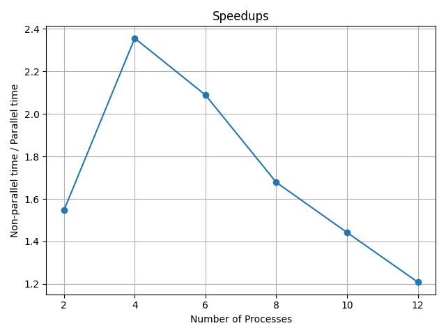

# Floyd-Warshall algorithm

## Algorithm
This is the algorithm to find shortest paths between all pairs of vertices in directed graph. The adjacency matrix is generated randomly with 0.5 probability of connection between each pair.

### Non-parallel version

Algorithm compares many possible paths through the graph between each pair of vertices. It is guaranteed to find all shortest paths and is able to do this with $O(V^3)$ comparisons in a graph.

### Parallel version

Using python library `multiprocessing`, the processing Pool is created where number of processes is a parameter. We have 3 loops in non-parallel version, so every process runs each iteration of the second loop independently, and after that we merge the results of all processes before starting next iteration of first loop. 

## Reproduction of results
-
    ```
    pip install numpy matplotlib
    ```

- Graph is generated during algorithm with fixed random_seed, so no need to save it.

-   ```
    python FloydWarshall.py number_of_nodes
    ```
    `number_of_nodes` is a number of vertices in graph and by default is 500. 

- Program will run the non-parallel algorithm and then parallel versions with number of processes in range `[2, 4, 6, 8, 10, 12]`. Every time it will print time of execution, speedup and check if sollutions are equal to a non-parallel solutions. After that it will plot graph and save it into `speedups.png`.


## Results
### Times and speedups
 - Non-parallel: 79.72 s
 - Parallel: 
    - 2  processes, 51.52 s, speedup = 1.55
    - 4  processes, 33.85 s, speedup = 2.36
    - 6  processes, 38.17 s, speedup = 2.09
    - 8  processes, 47.52 s, speedup = 1.68
    - 10 processes, 55.28 s, speedup = 1.44
    - 12 processes, 65.95 s, speedup = 1.21

### Plot


## Conclusions

As we can see, parallelization with every number of processes made our algorithm faster. The best speedup was with 4 proccesses and increasing it's number only worsen the performance.